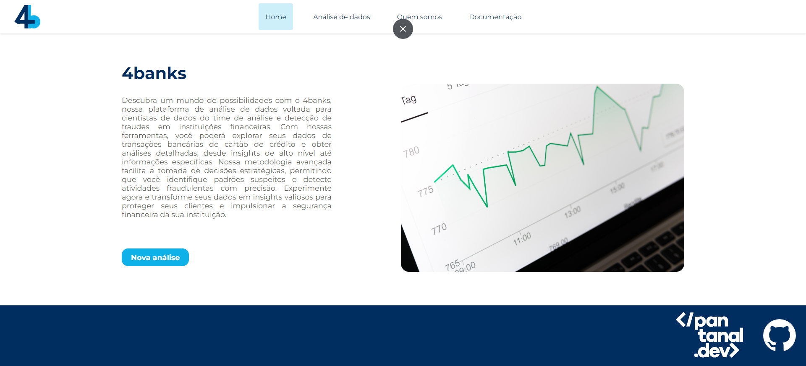
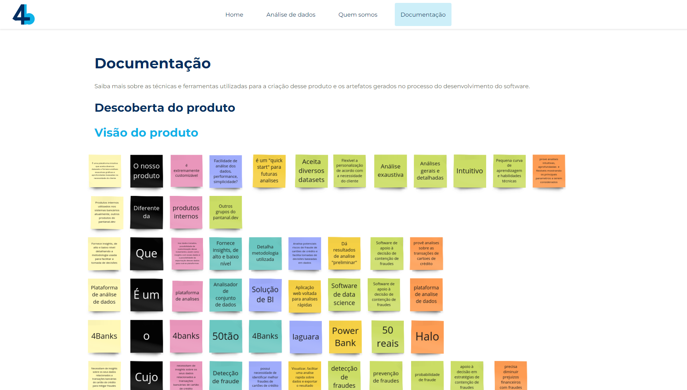

#  4banks

Bem-vindo à 4banks! Somos uma organização criada para o desenvolvimento do projeto do módulo Onça Pintada do programa [<pantanal.dev>](https://pantanal.dev/), uma iniciativa da Universidade Federal de Mato Grosso do Sul em parceria com as empresas B3, PDtec, BLK e Neoway.

Aqui, você encontrará os repositórios dos módulos do projeto e a documentação correspondente.

## Sobre Nós

Nossa equipe é composta por cinco integrantes:

### [Fabio Huang](https://www.linkedin.com/in/f%C3%A1bio-huang-0aa05b257/) - Cientista de Dados

Aluno do segundo ano de engenharia de computação na UFMS. Bolsista no Laboratório de Inteligência Artificial da universidade, implementando processamento de imagens para classificação com modelos de atenção. Almeja seguir carreira na área de IA.

### [João Pedro Vareiro](https://www.linkedin.com/in/joaovareiro/) - Desenvolvedor Front-end, Designer UI/UX

João Vareiro tem 20 anos e é estudante de Engenharia de Software na Universidade Federal de Mato Grosso do Sul, com Média Geral Acadêmica de 8,93/10. Seu principal interesse na área de TI é a Inteligência Artificial.

Atualmente trabalha no Laboratório de Inteligência Artificial da UFMS, atuando na gestão de projetos e no desenvolvimento de modelos de visão computacional focados na detecção e classificação da fauna e flora da mata atlântica. Além disso, contribui no desenvolvimento do back-end e realiza integração contínua e entrega contínua nos sistemas de avaliação e inscrição da Feira de Tecnologias, Engenharias e Ciências de Mato Grosso do Sul.

No projeto 4banks, desenvolveu o front-end e atuou no desenvolvimento do protótipo e na descoberta do produto.

Dentre suas experiências concluídas, trabalhou como trainee full-stack na SENAI Soluções Digitais, adquirindo conhecimentos em Java EE, Docker e Scrum. Também atuou como desenvolvedor front-end na Mega Júnior, onde desenvolveu aplicações em Vue.js. Além disso, foi membro da diretoria de Recursos Humanos, o que lhe proporcionou o desenvolvimento de habilidades interpessoais para resolver problemas entre os membros da empresa júnior, contribuindo para uma maior integração na equipe.

### [Lourdes Oshiro Igarashi](https://www.linkedin.com/in/lourdes-oshiro-igarashi/) - Desenvolvedora Front-end, Product Owner e Designer UI/UX

Lourdes Oshiro Igarashi tem 22 anos e é graduanda de Engenharia de Software na Universidade Federal de Mato Grosso do Sul.

É apaixonada pelas diversas facetas do desenvolvimento de software, em especial a descoberta e validação do produto, prototipação, engenharia de requisitos, gerenciamento de projetos e de software. Gosta de atuar em frentes criativas, planejar, organizar e encontrar soluções inovadoras em projetos de tecnologia.

No projeto 4banks, atuou na configuração do software, product owner, designer UI/UX e na documentação do projeto.

Já participou de diversos programas acadêmicos, como o PET Sistemas do Ministério da Educação, Elas programando, UNAPI (Universidade Aberta à Pessoa Idosa); e já atuou como representante discente do colegiado de Engenharia de Software; faz parte do LEDES (Laboratório de Desenvolvimento de Software) e do programa internacional de líderes Cargill Global Scholars.
É muito proativa, comunicativa, ambiciosa, determinada e quer realizar grandes feitos no mercado de computação, aliado a pesquisa e instituições de ensino.

### [Tiago Clarintino Santi](https://www.linkedin.com/in/tiago-santi/) - Desenvolvedor Back-end, Analista de Dados e DevOps
  
Com 22 anos de idade, Tiago Clarintino Santi é um aluno de Engenharia de Software na Universidade Federal de Mato Grosso do Sul, entusiasta de Inteligência Artificial.

Nos últimos anos, dedicou-se à exploração de Visão Computacional e Processamento de Linguagem Natural, empregando essas habilidades na solução de problemas complexos por meio do desenvolvimento de software. Como parte integrante do Laboratório de Inteligência Artificial da UFMS, contribuiu para a pesquisa em Deep Learning durante seu período de iniciação científica.

No projeto 4banks, desempenhou os papéis de desenvolvedor backend, analista de dados e DevOps. Aliado à habilidade de comunicação, experiência em trabalho colaborativo e um forte desejo de crescimento, está determinado a aprimorar suas habilidades no campo do desenvolvimento de software, tanto na esfera acadêmica quanto no mercado.

### [Mateus Mello](https://www.linkedin.com/in/mateuspmello/) - Mentor

Desenvolvedor de software há mais de 10 anos, formado pela UFSC em Sistemas de Informação. Atua na Neoway também como desenvolvedor de software no time de Plataforma de Dados responsável por toda ingestão dos dados na plataforma.

Acredita a tecnologia permite tornar as vidas das pessoas melhor e as empresas alcançarem novos patameres nos seus negócio.

## Nosso Produto

A plataforma 4banks, de análise de dados, é voltada para cientistas de dados do time de análise e detecção de fraudes em instituições financeiras.

Com nossa ferramenta, é possível explorar diversos datasets e obter uma análise personalizada, de acordo com a necessidade do usuário, e detalhada, com insights de alto nível e informações dos algoritmos.

Nossa metodologia avançada facilita a tomada de decisões estratégicas, permitindo que você identifique padrões suspeitos e detecte atividades fraudulentas com precisão. Nosso objetivo é transformar dados em insights valiosos para proteger seus clientes, impulsionar a segurança financeira da sua instituição, simplificando a sua experiência e agilizando seu dia a dia na área de ciência de dados.

Trazemos funcionalidades do processamento à visualização do resultado para você personalizar completamente sua pipeline, de acordo com a sua necessidade. Experimente as diversas opções para seleção de amostragem e transformação do dataset para melhorar a qualidade dos seus dados, e as variadas técnicas de análises superficiais, aprendizado de máquina e detecção de anomalias para obter insights profundos sobre o seu contexto.

### Página - Home

A página inicial do 4banks é a porta de entrada para a plataforma. Nela, o usuário pode visualizar as análises que foram realizadas no conjunto de dados "Credit Card Fraud Detection", utilizando métodos de balanceamento de dados, análises superficiais como média, moda e mediana, métodos de detecção de outliers algoritmos de Machine Learning, etc.

### Página - Análise de Dados

A página de análise de dados é onde o usuário pode inserir seu conjunto de dados rolutados e selecionar os tratamentos, análises e algoritmos que deseja utilizar para obter insights sobre os atributos que compõem o dataset.

### Página - Quem Somos

A página de quem somos é onde o usuário pode conhecer a equipe que desenvolveu o 4banks e suas respectivas funções no projeto.

### Página - Documentação

A página de documentação é onde o usuário pode conhecer mais sobre o projeto e a concepção do produto, como o design system, branch model, commit style, visão do produto, etc.

## Repositórios

Os repositórios do projeto estão divididos em 3 módulos: backend, frontend e documentation.

### [backend](https://github.com/4Banks/backend)

O backend do projeto foi desenvolvido utilizando a linguagem Python e framework Fast API. Os datasets e os resultados gerados pela aplicação são armazenados no Google Cloud Storage e a aplicação é hospedada em uma Máquina Virtual do Google Cloud Compute Engine.

### [frontend](https://github.com/4Banks/frontend)

O frontend do projeto foi desenvolvido utilizando a biblioteca React.js. A aplicação é hospedada em uma Máquina Virtual do Google Cloud Compute Engine.

### [documentation](https://github.com/4Banks/documentation)

A documentação do projeto envolvendo Branch Model, Commit Style, Design System, etc. está presente no repositório.
